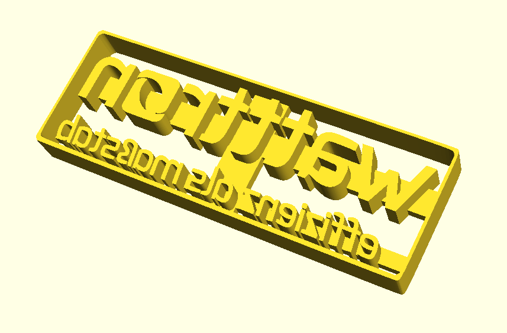

## Keksform

Das Modell ist mit [openSCAD](http://www.openscad.org/) aus den beiden SVG Dateien extrudiert.

### Issues

* Teig klebt zu sehr an Buchstaben und Rahmen
	* Rand ist zu nah an der Schrift
	* Stanztiefe und Abstand von Schrift zu Rahmen sollte größer sein 
